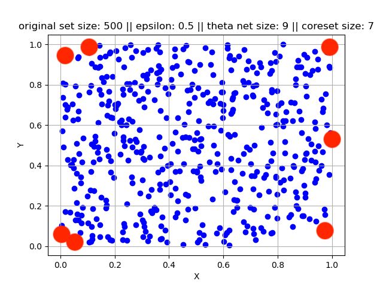
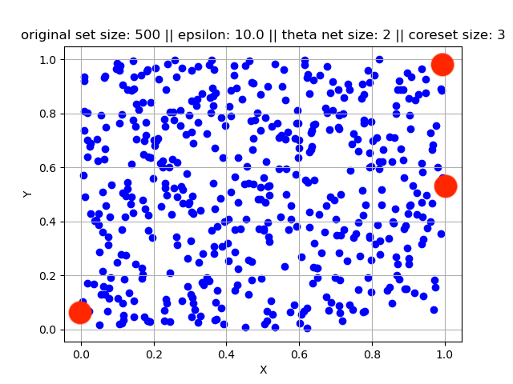

# Coreset for Minimum Enclosing Ball

[Link to Project Report](https://anmol-anand.github.io/paper/CoreSet_for_MEB_Project_Report.pdf)

## Overview

A core-set for the Minimum Enclosing Ball (MEB) problem is a reduced set of points that preserves the essential information required to find the smallest ball containing all the original data points. This reduction significantly reduces computational complexity, enabling quicker solutions for extensive datasets while maintaining accuracy.

In this project, we conduct experiments using a set of points in 2-dimensional space, both in an offline and a streaming setting. We consider a constant $\epsilon > 0$. The objectives of these experiments are as follows:

- Visualize the original data points and the computed coreset data points in a 2-dimensional space for various values of $\epsilon$.
- Explore how the accuracy of finding the Minimum Enclosing Ball (MEB) varies with the size of the coreset and, consequently, the value of $\epsilon$.

## Results

In both online and offline settings, we take a set of 500 points, we compute coresets for various values of epsilon and make the following observations:

1. The points in the coresets closely align with the boundary of the convex hull of the original set of points, as seen in Figure 1. In the figure, the blue points represent the original set, while the highlighted red points are part of the coreset too.

2. Additionally, we notice that as the value of epsilon increases, the size of the coreset decreases, leading to an increase in the error when finding the Minimum Enclosing Ball. This trend is consistent for both the offline setting (see Figure 2) and the online setting (see Figure 3).

  
  
   
  Figure 1: Offline coreset computation on an original set of size = 500
  (a) When epsilon is set to 0.5, it results in a coreset of size 7.
  (b) When epsilon is set to 10.0, it leads to a coreset of size 3.

  
  
   
  Figure 2: For the offline setting, we can see that as the value of epsilon increases, the coreset size decreases, and the error increases.

  
  
   
  Figure 3: For the online setting, we can see that as the value of epsilon increases, the coreset size decreases, and the error increases.

## Running the Code

To run the code, follow these steps:

1. Clone this repository locally.
2. Navigate to the cloned repository.
3. Set the desired hyperparameters:
   - For the offline setting: Open `offline_test.py` and modify the number of samples in `num_samples`, and modify the experimental values of epsilon in `epsilon_list`.
   - For the online setting: Open `online_test.py` and modify the number of samples in `num_samples`, modify the experimental values of epsilon in `epsilon_list`, and modify the buffer size in `buffer_size`.
4. Run the Python script:
   - For the offline setting: Run `offline_test.py`.
   - For the online setting: Run `online_test.py`.
